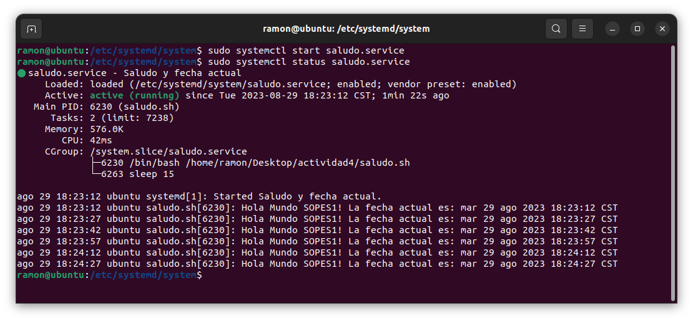

# Servicio de Saludo y Fecha Actual

Este servicio ejecuta un script que imprime el saludo "Hola Mundo SOPES1!" y la fecha actual de manera continua con un loop cada 15 segundos.

## Procedimiento para instalación

1. Se debe colocar el script `saludo.sh` en el directorio y se le deben de dar permisos de ejecución.
2. Se crea un archivo de unidad systemd llamado `saludo.service` en la ruta `/etc/systemd/system/`. Se debe de especificar la ruta del script en la sección `[Service]` del archivo de unidad.
3. Ejecutar los siguientes comandos para habilitar y comenzar el servicio:

   ```bash
   sudo systemctl daemon-reload          # Actualiza systemd
   sudo systemctl enable saludo.service  # Habilita el servicio para que se inicie en el arranque
   sudo systemctl start saludo.service   # Inicia el servicio

## Demostración de funcionamiento


